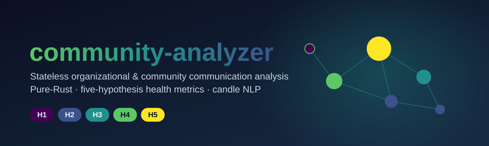

**English** | [日本語](README.ja.md)

# community-analyzer

In-memory, stateless library for organizational / community communication
analysis. It computes five-hypothesis health metrics
(**H1** exploration-vs-justification / **H2** psychological safety /
**H3** power gradient / **H4** pseudo-consensus / **H5** exploration / idea
diversity) over slices of platform-agnostic chat data, with Japanese-focused
in-process [candle](https://github.com/huggingface/candle) NLP (default on).

The library is platform-agnostic: it takes `Vec<Message>` / `Vec<Channel>` /
`Vec<User>` / `Vec<Reaction>` directly and never touches a database or a
specific platform API. Building adapters for Slack / Discord / Teams / GitHub
etc. is the caller's job.

## Install

The crate is not yet on crates.io; use the git dependency for now:

```toml
[dependencies]
community-analyzer = { git = "https://github.com/akitenkrad/rs-community-analyzer" }
chrono = { version = "0.4", features = ["serde"] }
```

Once published it will be available as `community-analyzer = "0.1"`.

**Features**: the default set is `lindera` + `nlp` (candle inference; Japanese
models auto-download on first use). For a lightweight build without the NLP
models use `--no-default-features --features lindera`.

## Documentation

* [Use cases](docs/en/use-cases.md) — runnable scenarios: quick health check,
  full report with NLP, offline / Rust-only mode, adapting a chat platform, and
  generating an anonymized report with figures.
* [Architecture](docs/en/architecture.md) — data model, thread / ID conventions,
  module overview, and the analysis pipeline.
* [Hypotheses](docs/en/hypotheses.md) — the H1–H5 table and each hypothesis's
  metric fields (Rust-only vs NLP-enriched).
* [NLP backend](docs/en/nlp.md) — the `Nlp` trait, `MockNlp` vs `CandleNlp`,
  model table, profiles, weight download, and morphology.
* [Ethics](docs/en/ethics.md) — aggregate-only output, anonymization, and the
  no-raw-ID-leak audit.

## License

MIT.
